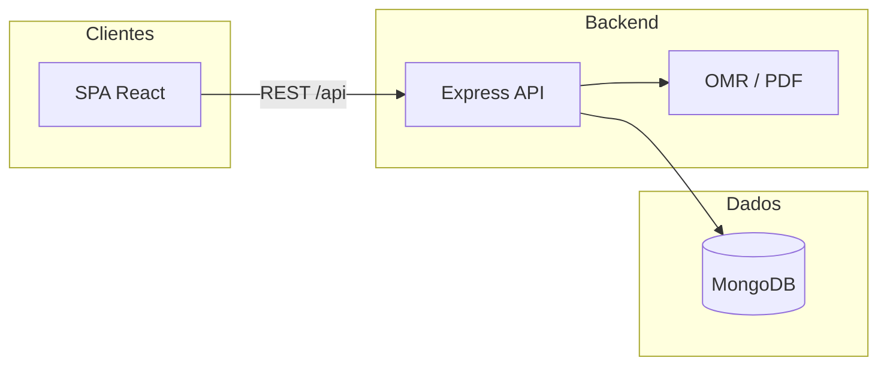

# SAEB / SPA-S — Plataforma de Diagnóstico Educacional

> Sistema full stack para **criar provas**, **corrigir cartões-resposta (OMR)**, **analisar desempenho por habilidade SAEB/SPA-S** e apoiar a gestão escolar — do professor à secretaria municipal.

Monorepo em produção de conceito: **API REST** + **SPA React** + **testes automatizados** (unitários, contrato OpenAPI, E2E com Playwright).

<p align="center">
  
  
  
  
  
  
</p>

---

## Por que este projeto existe

Escolas e redes municipais precisam ir além da nota final: entender **quais descritores** o aluno domina, onde intervir e como comparar turmas e unidades. Esta plataforma concentra o fluxo em um só lugar — cadastro escolar, banco de questões, montagem de provas, leitura de gabaritos e painéis de diagnóstico — com regras de acesso por perfil (RBAC).

**Público-alvo do produto:** professor, coordenador escolar, gestor municipal e administrador do sistema.

---

## O que o sistema faz

| Área | Capacidades |
|------|-------------|
| **Gestão escolar** | Escolas, turmas e alunos; escopo por município (IBGE); normalização de nomes para busca e deduplicação |
| **Banco de questões** | Questões LP/MAT (5º e 9º), matriz SAEB/SPA-S, descritores e dificuldade |
| **Provas** | Montagem personalizada, simulados, importação PDF, geração de cartões-resposta |
| **Correção** | Pipeline OMR (imagem do cartão) + gabarito oficial |
| **Resultados** | Ranking, mapa de calor por descritor, relatório por eixo, resumo por escola/município |
| **Segurança** | JWT, papéis (`admin`, `gestor`, `coordenador`, `professor`), isolamento por escola/município |

---

## Stack técnica

| Camada | Tecnologias |
|--------|-------------|
| **API** | Express 5, TypeScript, Mongoose, Zod, JWT, Swagger UI |
| **Web** | React 19, Vite 7, TanStack Query, React Router, Zod |
| **Dados** | MongoDB (Docker Compose no dev) |
| **Qualidade** | Jest (API), Vitest + Testing Library (web), testes de contrato OpenAPI, Playwright |
| **E2E** | Orquestrador Python (`run_e2e.py`) + Compose (Mongo dedicado) + Playwright |

---

## Arquitetura (visão geral)



**Hierarquia de domínio**

```
Município → Escola → Turma → Aluno
                ↓
    Provas → Cartões-resposta → Resultados / Diagnóstico
```

---

## Demo local em 3 passos

**Pré-requisitos:** Node 20+, npm, Docker (recomendado).

```bash
# 1) API + banco + dados de exemplo
cp backend/.env.example backend/.env
cd backend && npm install && npm run setup

# 2) Frontend
cp web/.env.example web/.env
cd ../web && npm install

# 3) Dois terminais
cd backend && npm run dev    # http://localhost:3001
cd web && npm run dev        # http://localhost:5173
```

| O quê | URL |
|-------|-----|
| Aplicação | http://localhost:5173 |
| API (health) | http://localhost:3001/health |
| Swagger | http://localhost:3001/docs |

### Acesso rápido (seed)

Senha para todos os usuários de teste: **`Admin123`**

| E-mail | Perfil |
|--------|--------|
| `admin@saeb.local` | Administrador |
| `gestor@saeb.local` | Gestor municipal |
| `professor@saeb.local` | Professor |

---

## Destaques para portfólio / code review

- **Monorepo** com front e back desacoplados, contrato HTTP documentado (OpenAPI) e testes de contrato.
- **RBAC** real (gestor vê só o município, professor vinculado à escola/turmas).
- **OMR** e geração de PDF no backend — não é só CRUD.
- **CI** no GitHub Actions: testes de API, web e suíte E2E com Mongo isolado.
- **Qualidade de dados** (ex.: `name` + `normalizedName` em escolas) para busca e anti-duplicata por município.

---

## Estrutura do repositório

```
├── backend/     # API Express + MongoDB + OMR
├── web/         # SPA React (Vite)
├── e2e/         # Playwright + orquestrador Python
└── docs/        # Débito técnico, decisões, guias
```

| Pasta | Documentação |
|-------|----------------|
| [backend/](backend/) | API, seed, Docker do Mongo |
| [web/](web/) | Interface; proxy dev → `:3001` |
| [e2e/](e2e/) | [Guia E2E completo](e2e/README.md) |
| [docs/](docs/) | Backlog técnico, revisões de dependências |

---

## Testes e CI

```bash
cd backend && npm test          # unit + integração + contrato OpenAPI
cd web && npm test && npm run lint
```

E2E (Mongo na porta `27018` + API + Playwright): ver [e2e/README.md](e2e/README.md).

Pipeline: [`.github/workflows/ci.yml`](.github/workflows/ci.yml) — backend, web e E2E.

---

<details>
<summary><strong>Comandos detalhados (backend)</strong></summary>

| Comando | Descrição |
|---------|-----------|
| `npm run dev` | API em desenvolvimento |
| `npm run build` / `npm run start` | Build e execução de produção |
| `npm run check` | `tsc --noEmit` |
| `npm run setup` | Docker Mongo + seed |
| `npm run seed` | Apenas seed |
| `npm run db:up` / `db:down` / `db:reset` | Ciclo do Mongo local |

Variáveis em `backend/.env`: `PORT`, `DATABASE_URL`, `JWT_SECRET`.

</details>

<details>
<summary><strong>Comandos detalhados (web)</strong></summary>

| Comando | Descrição |
|---------|-----------|
| `npm run dev` | Vite em `:5173` |
| `npm run build` | Typecheck + build |
| `npm run preview` | Preview do build |
| `npm run lint` | ESLint |
| `npm run test` | Vitest |

Em dev, `VITE_API_BASE_URL` vazio usa o proxy do Vite para a API.

</details>

<details>
<summary><strong>E2E — resumo</strong></summary>

```bash
python e2e/run_e2e.py up
export DATABASE_URL="mongodb://127.0.0.1:27018/spas_saeb?directConnection=true"
cd backend && npm run dev
# outro terminal:
python e2e/run_e2e.py test
python e2e/run_e2e.py down
```

Variáveis: `E2E_BASE_URL`, `E2E_SKIP_API_SMOKE`, `E2E_SKIP_WEB_SERVER` — detalhes em [e2e/README.md](e2e/README.md).

</details>

---

## Documentação adicional

| Documento | Conteúdo |
|-----------|----------|
| [backend/docs/prd/prd.md](backend/docs/prd/prd.md) | Visão de produto e requisitos |
| [docs/technical-debt-jira-tasks.md](docs/technical-debt-jira-tasks.md) | Backlog técnico |
| [docs/web-xlsx-risk-review.md](docs/web-xlsx-risk-review.md) | Análise de risco `xlsx` (importação de planilhas) |

---

## Licença

Projeto privado / uso interno conforme política do repositório. Consulte o mantenedor antes de redistribuir.
